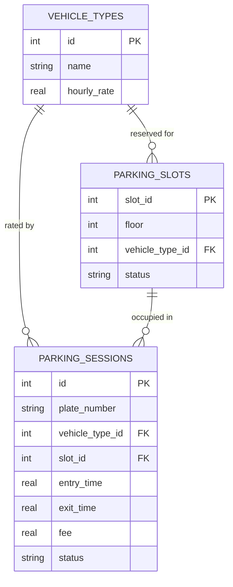

# Modern Parking Management System

A system that lets a driver check parking availability before entering,
records each vehicle on entry, and on exit calculates how long it stayed
and how much it owes — then frees up the slot again.

## 1. Language choice

**Python** is used, per preference, and it's genuinely a good fit here:

| Reason | Why it matters for this assignment |
|---|---|
| Built-in `sqlite3` | No external DB server needed to demonstrate the database design |
| Built-in `heapq` | Gives the priority-queue behaviour the algorithm needs, for free |
| Readability | Easier to grade / follow the algorithm logic than C++ or Java boilerplate |
| Fast to prototype | Assignment is about *algorithm + design*, not systems performance |

Java or C++ would be reasonable if this were a production embedded system
(e.g. running on the physical gate hardware) where raw speed and static
typing matter more — but for demonstrating the algorithm and data
structures, Python keeps the logic front and center.

## 2. The Algorithm

Three operations, plus a helper for billing.

slot_id = pop lowest-numbered slot from available_slots   # O(log n)
entry_time = now()
write session row to DB (status = ACTIVE)
active_sessions[plate] = {slot_id, entry_time, vehicle_type}  # O(1)
mark slot OCCUPIED in DB
return slot_id

exit_time = now()
duration_hours = (exit_time - session.entry_time) / 3600
fee = CALCULATE_FEE(duration_hours, session.vehicle_type)

update DB session row: exit_time, fee, status = CLOSED
push slot_id back onto available_slots                 # O(log n)
mark slot FREE in DB
remove plate from active_sessions                       # O(1)
return {duration_hours, fee}


## 3. Data Structures Used

| Structure | Used for | Why this one |
|---|---|---|
| **Min-heap** (`heapq`) of free slot numbers | Tracking which slots are free, allocating on entry, releasing on exit | Always hands out the lowest free slot deterministically; O(log n) push/pop, far better than scanning an array of slots (O(n)) for the first free one |
| **Hash map** (`dict`) `plate_number -> session info` | Looking up a currently-parked vehicle when it exits | O(1) average lookup — the alternative (searching a list of parked vehicles) is O(n), which doesn't scale as the lot fills up |
| **Relational database** (SQLite) | Durable, queryable record of every entry/exit and slot status | Availability and history need to survive a restart, and be query-able (e.g. "how many trucks parked today") — that's a job for a DB, not in-memory structures |

Together: the heap and hash map give fast *in-memory* decisions
(O(log n) and O(1)), while the database gives *durability* and reporting.

## 4. Database Design

Three tables:



- **vehicle_types** — lookup table of vehicle categories and their hourly rate.
- **parking_slots** — one row per physical slot; `status` is `FREE` or `OCCUPIED`,
  kept in sync with the in-memory heap so the DB is always a source of truth.
- **parking_sessions** — one row per visit (entry → exit). `status = ACTIVE`
  while parked, `CLOSED` once the fee is calculated on exit.

## 5. Running it

```bash
python demo.py
```

This creates a SQLite file in the same folder and prints availability,
an entry, and an exit with the fee calculated.
